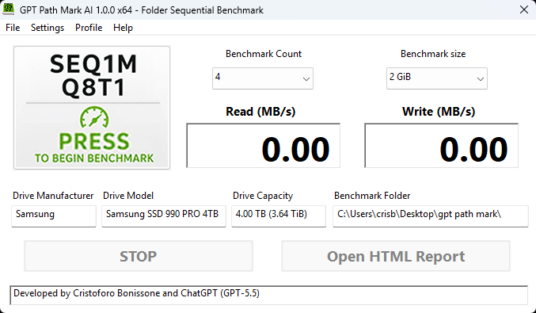
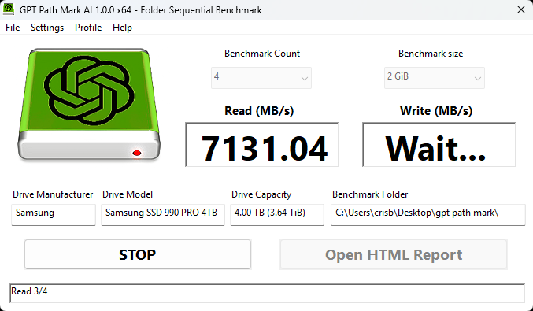
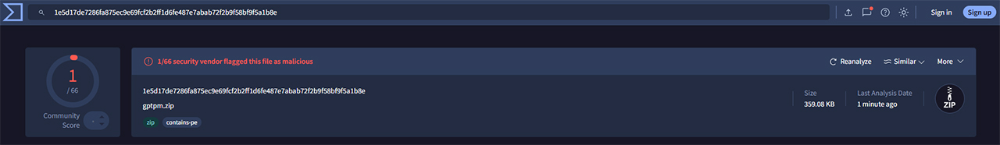

# GPT Path Mark AI

# GPT Path Mark AI

## Benchmark

GPT Path Mark AI is Real Windows File System Benchmark for SSD, NVMe and HDD for Windows.

Unlike traditional low-level synthetic disk benchmarks, GPT Path Mark AI
measures the performance of a selected folder through the Windows file system.

This provides results that closely represent common operations such as:

- Copying large files
- Backup operations
- Disk imaging
- ISO creation
- Video file transfers
- SSD and NVMe performance testing

### SEQ1M Q8T1

- Sequential read and write
- 1 MiB block size
- Queue depth 8
- 1 software thread

The test is designed to measure sustained storage throughput.

## System requirements

- Microsoft Windows
- SSD, NVMe, HDD or other file-system-accessible storage device

## Download

➡ **Download the latest release**

https://github.com/CristoforoBonissone/GPT-Path-Mark-AI/releases/latest

## Virus Total Report 1/66 (False Positive)

A 1 False Positive to 66 is Possible but here Everyting is Clean

https://www.virustotal.com/gui/file/1e5d17de7286fa875ec9e69fcf2b2ff1d6fe487e7abab72f2b9f58bf9f5a1b8e?nocache=1

## Author

Cristoforo Bonissone  
https://www.dacris.it/gptpm/index.html

## License

benchmark
disk-benchmark
ssd
nvme
windows
filesystem
storage
performance
